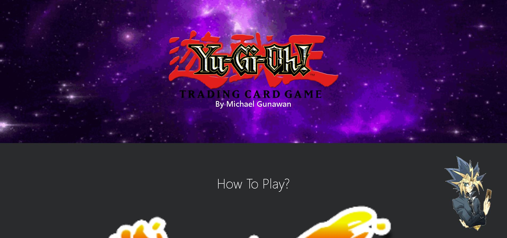
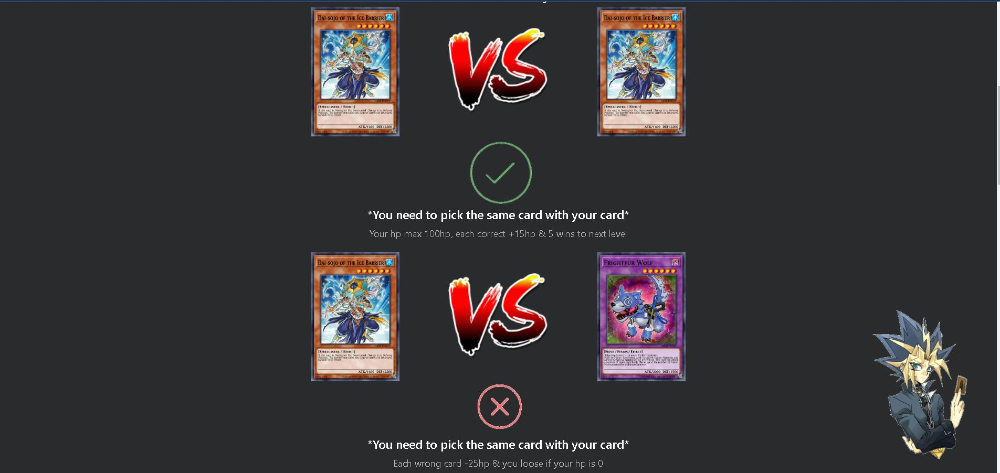
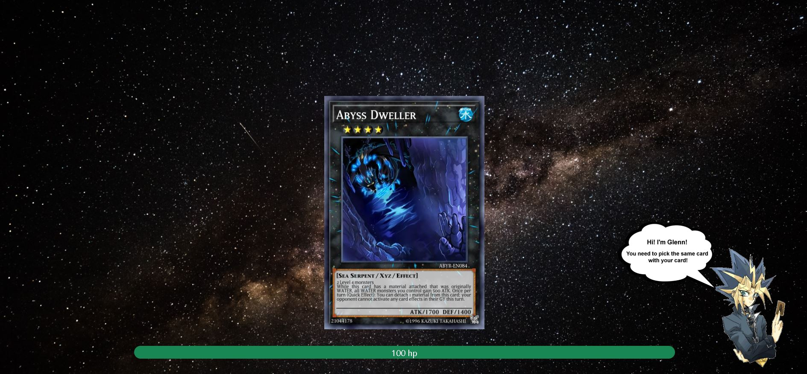
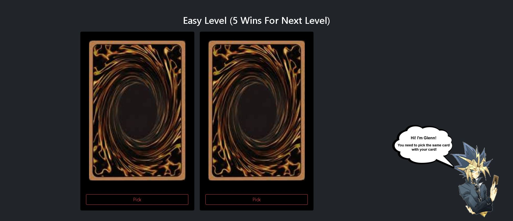
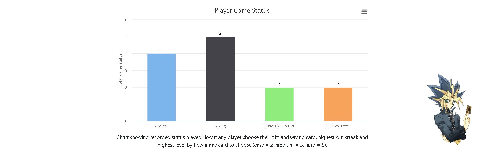

# Card Game By MG

Card game created using HTML, CSS, Javascript. The card data for this game uses API from YGOPRODeck. To play this game, the player needs to pick a card that same as the player's Irish card. Players have a 100hp maximum and every time the player chooses the wrong card, the hp will decrease -25hp and if correct +15hp. Every win 5 times the player will be going to the next level, the level will be easy (2 cards) – medium (3 cards) – hard (6 cards). The game will be displayed win streak and player status.

## Table of Contents

- [General Info](#general-information)
- [Technologies Used](#technologies-used)
- [Features](#features)
- [Screenshots](#screenshots)
- [Room for Improvement](#room-for-improvement)
- [Acknowledgements](#acknowledgements)
- [Contact](#contact)

## General Information

- Get Data from Yu-Gi-Oh! API by YGOPRODeck
- One page load without refresh the page
- Full HTML, CSS & Javascript
- Interactive website with animation

## Tools Used

- Bootstrap5.1 - https://getbootstrap.com/docs/5.1/layout/grid/
- Highcharts - https://www.highcharts.com/docs/index
- Vanilla-tilt JS - https://micku7zu.github.io/vanilla-tilt.js/
- Sweetalert2 - https://sweetalert2.github.io/#download

## Features

List the ready features here:

- Count Win Streak
- Animation Flip Card
- Animation Hover Card
- Pet With Hover Explain How To Play
- Health Progress Bar
- Level easy-hard (min: 2 cards, max: 6 cards)
- Player Status (how many correct, wrong, highest win streak & level)

## Screenshots

## Room for Improvement

There is a plan for improvement with this project, to make this game more interactive and help the player to get the higher level.

Room for improvement:

- Improvement to be done animation health decrease or increase
- Improvement to be done interactive pet chatting

To do:

- Feature to be added every 5 wins streak in a row get 1 coin
- Feature to be added coins can be used to buy hints

## Acknowledgements

- This project was inspired by my childhood card games played with my friends.
- Many thanks to my Flatiron school lectures
- This is my phase1 project at Flatiron school

## Contact

Created by [@mg](https://www.linkedin.com/in/michael-gunawan-030a52194/) - feel free to contact me!
